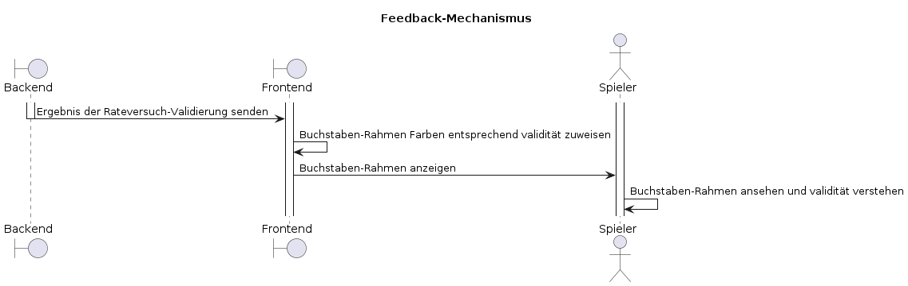
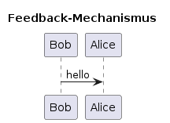

# F002 - Feedback-Mechanismus

Als Spieler möchte ich nach jeder Eingabe Feedback erhalten, damit ich weiß, wie nah ich am richtigen Wort bin.

[GitHub-Issue](https://github.com/wordle-time/wordle-time/issues/2)

## Auswirkung

Informiert den Spieler über den Status seiner Eingabe.

## Akzeptanzkriterien

- Ich sehe Farbcodes oder Symbole, die den Status meiner Eingabe anzeigen.
- Das Feedback ist konsistent und leicht verständlich.

## Sequenzdiagramm

## Aktivitätsdiagramm

