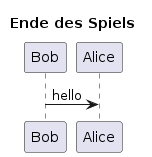

# F005 - Ende des Spiels

Als Spieler möchte ich ein Wort oder einen Buchstaben eingeben können, damit ich am Spiel teilnehmen und das Wort erraten kann.

[GitHub-Issue](https://github.com/wordle-time/wordle-time/issues/5)

## Auswirkung

Ermöglicht die Interaktion des Spielers mit dem Spiel

## Akzeptanzkriterien

- Das Eingabefeld akzeptiert und validiert meine Eingabe
- Ich erhalte eine Rückmeldung, wenn meine Eingabe ungültig ist

## Sequenzdiagramm

## Aktivitätsdiagramm

